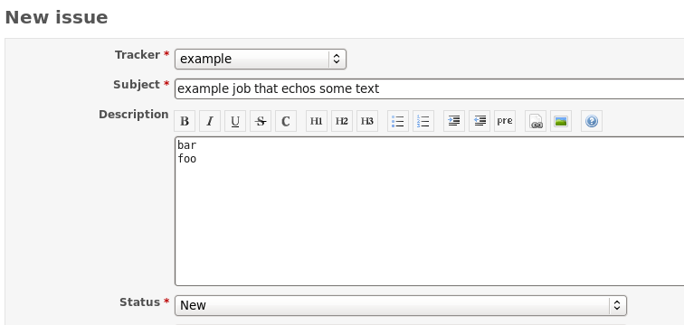
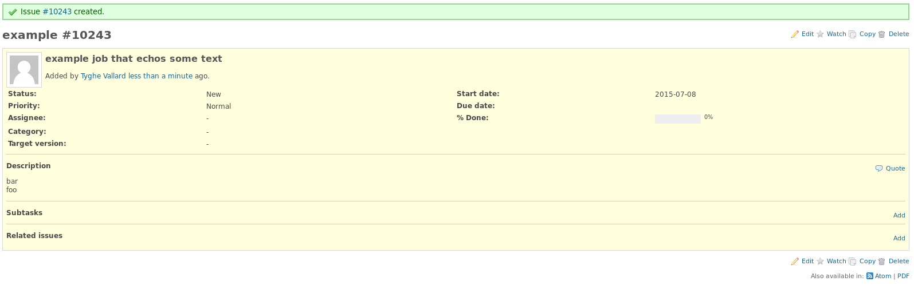
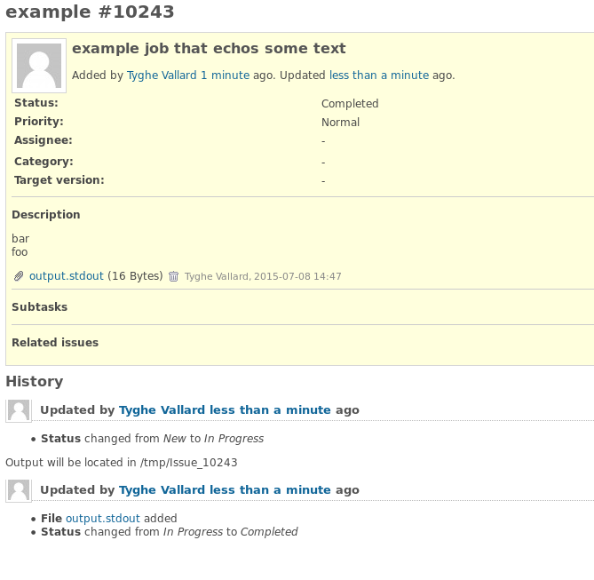

==============
Running Issues
==============

Once you have configured both your Redmine trackers and the config file to match them
you are set up to start creating issues and running them.

You can easily run your issues using the ``runissue`` command which simply fetches
the issue id you give it and then executes the defined cli in the config file mixed
with arguments from the issue's description.

Using the default configuration file ``redscheduler.config.example`` that comes
with the project when you download it, we will do an example.

Create your first issue
=======================

Here we can see that issue #10243 was created. We will need this number to run the
issue.

Run the issue
=============

.. code-block:: bash

    $> runissue 10243
    Updated issue status with output location and set to In Progress
    Creating /tmp/Issue_10243 to run in
    Running echo -e foo
    bar bar foo
    Return code was 0
    Saving issue with new status Completed
    

Check output file contents
==========================

You can see that the issue wrote all standard output into the defined ``stdout``
file, output.stdout. 

.. code-block:: bash

    $> cat /tmp/Issue_10243/output.stdout 
    foo
    bar bar foo

Additionally, stderr was empty(``Size: 0``)

.. code-block:: bash

    $> stat /tmp/Issue_10243/stderr.txt 
      File: `/tmp/Issue_10243/stderr.txt'
      Size: 0           Blocks: 0          IO Block: 4096   regular empty file
    Device: 803h/2051d  Inode: 356         Links: 1
    Access: (0644/-rw-r--r--)  Uid: (500/username)   Gid: (500/username)
    Access: 2015-07-08 14:49:24.369910594 -0400
    Modify: 2015-07-08 14:49:24.369910594 -0400
    Change: 2015-07-08 14:49:24.369910594 -0400

Verify issue
============

Here you can see that the issue was first updated to show that it was running by
changing the status from ``New`` to ``In Progress``. It also creates a note showing
the output location that the job will be run in(``/tmp/Issue_10243``)

After the job completes it updated the issue again, changing the status from
``In Progress`` to ``Completed``. Also, because our config has uploads defined,
the output.stdout file was uploaded back to the issue.

